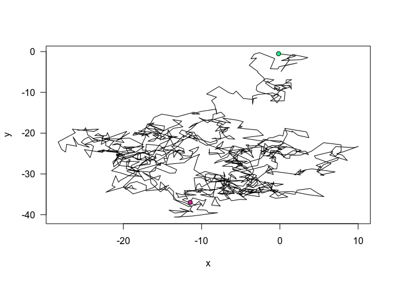

<!-- README.md is generated from README.Rmd. Please edit that file -->

# firstPack

<!-- badges: start -->

[](https://travis-ci.com/ehyaei/firstPack)
<!-- badges: end -->

# firstPack

R package to simulate and plot Brownian motion, written to illustrate R
package development.

## Installation

Install with the devtools package:

``` r
devtools::install_github("ehyaei/firstPack")
```

## Example

Use `simBrM()` to simulate and `plotBrM()` to plot the result.

``` r
library(firstPack)
x <- simBrM(1000)
plotBrM(x)
```


